# Multi-Agent Financial AI Systems in Automated Trading

<div align="center">


**An intelligent multi-agent system for automated stock trading using machine learning**

</div>

---

## 📋 Table of Contents

1. [Cover Page](#-multi-agent-financial-ai-systems-in-automated-trading)
2. [Abstract](#-abstract)
3. [Introduction & Problem Statement](#-introduction--problem-statement)
4. [Background & Related Work](#-background--related-work)
5. [System Design & Architecture](#-system-design--architecture)
6. [Agent Descriptions](#-agent-descriptions)
7. [Agent Communication Protocol](#-agent-communication-protocol)
8. [How the System Works](#-how-the-system-works)
9. [Implementation Details](#-implementation-details)
10. [Results & Evaluation](#-results--evaluation)
11. [What Worked & What Didn't](#-what-worked--what-didnt)
12. [Conclusion & Future Ideas](#-conclusion--future-ideas)
13. [Installation & Running Instructions](#-installation--running-instructions)
14. [References](#-references)
15. [Appendix: Screenshots & Code](#-appendix-screenshots--code)

---

## 📄 Abstract

This project presents a **Multi-Agent Financial AI System** designed for automated stock trading. The system employs three specialized AI agents that collaborate to analyze market data, make trading decisions, and execute trades. Built using modern technologies including **FastAPI**, **React**, **PostgreSQL**, and **scikit-learn**, the system processes historical NASDAQ stock data (3,337 stocks) to train machine learning models for price prediction.

The architecture follows an event-driven microservices pattern where agents communicate through a central coordinator using asynchronous message passing. The Market Monitoring Agent uses **Random Forest Regression** for price prediction (achieving ~$5 RMSE), the Decision Making Agent employs **Gradient Boosting Classification** for trade signals, and the Execution Agent manages portfolio operations with real-time feedback loops for continuous model improvement.

**Keywords:** Multi-Agent Systems, Automated Trading, Machine Learning, Financial AI, Stock Prediction, FastAPI, React

---

## 🎯 Introduction & Problem Statement

### The Challenge of Automated Trading

Financial markets are complex, dynamic systems where prices are influenced by countless factors including market sentiment, economic indicators, company performance, and global events. Traditional trading approaches struggle with:

1. **Information Overload**: Thousands of stocks generate massive amounts of data daily
2. **Speed Requirements**: Market opportunities exist for milliseconds
3. **Emotional Bias**: Human traders make irrational decisions under pressure
4. **Pattern Recognition**: Subtle patterns are invisible to human analysis
5. **Continuous Monitoring**: Markets operate across global time zones

### Our Solution

This project addresses these challenges through a **multi-agent AI system** that:

- **Distributes responsibility** among specialized agents
- **Automates analysis** of historical and real-time data
- **Removes emotional bias** through algorithmic decision-making
- **Learns continuously** from trading outcomes
- **Scales efficiently** to monitor multiple stocks simultaneously

### Research Questions

1. How can multiple AI agents collaborate effectively for trading decisions?
2. What machine learning models are most suitable for price prediction?
3. How should feedback loops be designed for continuous improvement?
4. What architecture supports real-time trading with historical learning?

---

## 📚 Background & Related Work

### Multi-Agent Systems (MAS)

Multi-Agent Systems consist of multiple interacting intelligent agents working together to solve complex problems. In financial applications, MAS offers several advantages:

- **Specialization**: Each agent focuses on specific tasks
- **Parallelism**: Agents operate concurrently
- **Robustness**: System continues if one agent fails
- **Scalability**: New agents can be added easily

### Related Work in Algorithmic Trading

| System | Approach | Limitation |
|--------|----------|------------|
| Traditional Algorithmic Trading | Rule-based systems | Cannot adapt to new patterns |
| Single ML Model Trading | One model for all tasks | Lacks specialization |
| High-Frequency Trading (HFT) | Speed-focused | Requires expensive infrastructure |
| **Our System** | Multi-agent ML collaboration | Balances accuracy and adaptability |

### Machine Learning in Finance

- **Random Forest**: Ensemble method effective for regression with noisy financial data
- **Gradient Boosting**: Powerful for classification tasks like buy/sell decisions
- **Technical Indicators**: RSI, MACD, Bollinger Bands provide domain knowledge

### Technologies Used

| Technology | Purpose | Justification |
|------------|---------|---------------|
| FastAPI | Backend API | Async support, automatic OpenAPI docs |
| React + TypeScript | Frontend | Type safety, component reusability |
| PostgreSQL | Database | ACID compliance, complex queries |
| scikit-learn | ML Models | Proven algorithms, easy integration |
| Docker | Containerization | Reproducible deployments |

---

## 🏗 System Design & Architecture

### High-Level Architecture

```
┌─────────────────────────────────────────────────────────────────────────┐
│                           FRONTEND (React + TypeScript)                 │
│  ┌─────────┐ ┌─────────┐ ┌─────────┐ ┌─────────┐ ┌─────────┐           │
│  │Dashboard│ │ Stocks  │ │Portfolio│ │ Trading │ │Training │           │
│  └────┬────┘ └────┬────┘ └────┬────┘ └────┬────┘ └────┬────┘           │
│       └───────────┴───────────┴───────────┴───────────┘                 │
│                               │ HTTP/REST API                           │
└───────────────────────────────┼─────────────────────────────────────────┘
                                │
┌───────────────────────────────┼─────────────────────────────────────────┐
│                    BACKEND (FastAPI + Python)                           │
│                               │                                         │
│  ┌────────────────────────────┴────────────────────────────────────┐    │
│  │                    TRADING COORDINATOR                           │    │
│  │         (Orchestrates all agent communication)                   │    │
│  └───────────┬─────────────────┬─────────────────┬─────────────────┘    │
│              │                 │                 │                      │
│   ┌──────────▼──────┐ ┌────────▼────────┐ ┌──────▼───────┐             │
│   │ MARKET MONITOR  │ │ DECISION MAKER  │ │  EXECUTION   │             │
│   │     AGENT       │ │     AGENT       │ │    AGENT     │             │
│   │                 │ │                 │ │              │             │
│   │ • Load Data     │ │ • Analyze       │ │ • Execute    │             │
│   │ • Train Models  │ │   Predictions   │ │   Trades     │             │
│   │ • Predict       │ │ • Risk Assess   │ │ • Track P&L  │             │
│   │   Prices        │ │ • Make Decisions│ │ • Feedback   │             │
│   └────────┬────────┘ └────────┬────────┘ └──────┬───────┘             │
│            │                   │                 │                      │
│   ┌────────▼───────────────────▼─────────────────▼───────┐             │
│   │              POSTGRESQL DATABASE                      │             │
│   │  • Users & Auth  • Portfolios  • Stock Prices        │             │
│   │  • Transactions  • Predictions • Trade History       │             │
│   └──────────────────────────────────────────────────────┘             │
└─────────────────────────────────────────────────────────────────────────┘
```

### Agent Communication Diagram

```
                    ┌─────────────────────┐
                    │  TRADING COORDINATOR │
                    │    (Orchestrator)    │
                    └──────────┬──────────┘
                               │
           ┌───────────────────┼───────────────────┐
           │                   │                   │
           ▼                   ▼                   ▼
    ┌──────────────┐   ┌──────────────┐   ┌──────────────┐
    │    MARKET    │   │   DECISION   │   │  EXECUTION   │
    │   MONITOR    │──▶│    MAKER     │──▶│    AGENT     │
    │    AGENT     │   │    AGENT     │   │              │
    └──────┬───────┘   └──────────────┘   └──────┬───────┘
           │                                      │
           │                                      │
           │         FEEDBACK LOOP                │
           ◀──────────────────────────────────────┘
           
    Data Flow:
    1. Market Monitor → Predictions → Decision Maker
    2. Decision Maker → Trade Signals → Execution Agent
    3. Execution Agent → Feedback → Market Monitor (Model Improvement)
```

### Database Schema

```
┌─────────────────┐     ┌─────────────────┐     ┌─────────────────┐
│     USERS       │     │   PORTFOLIOS    │     │  TRANSACTIONS   │
├─────────────────┤     ├─────────────────┤     ├─────────────────┤
│ id (PK)         │────▶│ id (PK)         │────▶│ id (PK)         │
│ email           │     │ user_id (FK)    │     │ portfolio_id(FK)│
│ hashed_password │     │ cash            │     │ symbol          │
│ is_active       │     │ initial_capital │     │ type (BUY/SELL) │
│ created_at      │     │ created_at      │     │ quantity        │
└─────────────────┘     └─────────────────┘     │ price           │
                                                │ profit_loss     │
┌─────────────────┐     ┌─────────────────┐     │ created_at      │
│  STOCK_PRICES   │     │   POSITIONS     │     └─────────────────┘
├─────────────────┤     ├─────────────────┤
│ id (PK)         │     │ id (PK)         │
│ symbol          │     │ portfolio_id(FK)│
│ date            │     │ symbol          │
│ open            │     │ quantity        │
│ high            │     │ avg_buy_price   │
│ low             │     │ current_value   │
│ close           │     │ unrealized_pnl  │
│ volume          │     └─────────────────┘
│ after_hours     │
│ pre_market      │
└─────────────────┘
```

---

## 🤖 Agent Descriptions

### 1. Market Monitoring Agent

**Purpose**: Analyze historical market data and predict future price movements.

**Implementation**: `backend/app/agents/market_agent.py`

**Responsibilities**:
- Load historical stock data from CSV files or database
- Calculate technical indicators (RSI, MACD, Bollinger Bands, Moving Averages)
- Train Random Forest Regression model for price prediction
- Generate price predictions with confidence scores
- Identify market patterns and trends

**Machine Learning Model**:
```python
RandomForestRegressor(
    n_estimators=100,      # Number of trees
    max_depth=15,          # Maximum tree depth
    min_samples_split=5,   # Minimum samples to split
    min_samples_leaf=2,    # Minimum samples in leaf
    random_state=42        # Reproducibility
)
```

**Features Used**:
- Price features: Open, High, Low, Close, Volume
- Technical indicators: RSI(14), MACD, Bollinger Bands
- Moving averages: 5-day, 10-day, 20-day, 50-day
- Momentum indicators: Price momentum, volume changes
- Lagged values: Previous 5 days' prices

**Output Format**:
```python
{
    "symbol": "AAPL",
    "current_price": 185.50,
    "predicted_price": 188.20,
    "predicted_change_percent": 1.45,
    "confidence": 0.82,
    "technical_indicators": {
        "RSI": 55.3,
        "MACD": 2.15,
        "BB_Position": 0.65
    },
    "status": "predicted"
}
```

---

### 2. Decision Making Agent

**Purpose**: Analyze predictions and make trading decisions based on risk tolerance.

**Implementation**: `backend/app/agents/decision_agent.py`

**Responsibilities**:
- Receive predictions from Market Monitor
- Apply risk-adjusted decision logic
- Generate BUY/SELL/HOLD signals
- Learn from historical decision outcomes
- Adapt thresholds based on feedback

**Machine Learning Model**:
```python
GradientBoostingClassifier(
    n_estimators=100,
    learning_rate=0.1,
    max_depth=5,
    random_state=42
)
```

**Decision Logic**:
```
Risk Tolerance: 0.0 (Conservative) to 1.0 (Aggressive)

BUY Signal:
  - Predicted change > buy_threshold (adjusted by risk)
  - Confidence >= min_confidence
  - RSI not overbought (< 70)

SELL Signal:
  - Predicted change < sell_threshold (adjusted by risk)
  - Confidence >= min_confidence
  - RSI not oversold (> 30)

HOLD Signal:
  - Neither BUY nor SELL conditions met
```

**Risk-Adjusted Thresholds**:
| Risk Level | Buy Threshold | Sell Threshold | Min Confidence |
|------------|---------------|----------------|----------------|
| 0.0 (Conservative) | +1.0% | -1.0% | 60% |
| 0.5 (Moderate) | +0.55% | -0.55% | 50% |
| 1.0 (Aggressive) | +0.1% | -0.1% | 40% |

**Output Format**:
```python
{
    "symbol": "AAPL",
    "decision": "BUY",
    "confidence": 0.78,
    "reason": "Strong upward prediction (+1.45%) with high confidence",
    "suggested_position_size": 0.1,  # 10% of portfolio
    "stop_loss": 182.00,
    "take_profit": 195.00
}
```

---

### 3. Execution Agent

**Purpose**: Execute trading decisions and track portfolio performance.

**Implementation**: `backend/app/agents/execution_agent.py`

**Responsibilities**:
- Execute BUY/SELL orders from Decision Maker
- Manage user portfolios and positions
- Track order status (PENDING, EXECUTED, FAILED)
- Calculate profit/loss metrics
- Generate feedback for model improvement

**Order Execution Flow**:
```
1. Receive decision from Decision Maker
2. Validate order (sufficient funds, valid symbol)
3. Calculate position size based on risk
4. Execute trade through Portfolio Service
5. Record transaction in database
6. Update position and cash balances
7. Calculate unrealized P&L
8. Generate feedback for learning
```

**Portfolio Management**:
```python
{
    "cash": 50000.00,
    "positions_value": 25000.00,
    "total_value": 75000.00,
    "profit_loss": 5000.00,
    "profit_loss_percent": 7.14,
    "positions": [
        {
            "symbol": "AAPL",
            "quantity": 50,
            "avg_buy_price": 180.00,
            "current_price": 185.50,
            "unrealized_pnl": 275.00
        }
    ]
}
```

**Feedback Generation**:
```python
{
    "symbol": "AAPL",
    "trade_type": "BUY",
    "entry_price": 180.00,
    "exit_price": 185.50,  # If sold
    "profit_loss": 275.00,
    "was_correct": True,
    "prediction_error": 0.5  # Difference from predicted price
}
```

---

## 🔄 Agent Communication Protocol

### Communication Architecture

The agents communicate through a **message-passing pattern** orchestrated by the Trading Coordinator. This ensures:

1. **Loose Coupling**: Agents don't directly depend on each other
2. **Traceability**: All messages are logged
3. **Flexibility**: Easy to add new agents or modify behavior

### Message Flow

```python
# Trading Cycle Message Flow

1. Coordinator → Market Monitor: "Analyze symbols: [AAPL, MSFT, GOOGL]"
   Response: [predictions for each symbol]

2. Coordinator → Decision Maker: "Make decisions for: [predictions]"
   Response: [decisions for each symbol]

3. Coordinator → Execution Agent: "Execute decisions: [decisions]"
   Response: [execution results]

4. Coordinator → Execution Agent: "Generate feedback"
   Response: [feedback for model improvement]

5. Coordinator → Market Monitor: "Update model with feedback"
   Response: "Model updated"
```

### Data Structures

**Prediction Message**:
```json
{
    "type": "PREDICTION",
    "timestamp": "2024-01-15T10:30:00Z",
    "source": "MarketMonitor",
    "destination": "DecisionMaker",
    "payload": {
        "symbol": "AAPL",
        "current_price": 185.50,
        "predicted_price": 188.20,
        "confidence": 0.82,
        "technical_indicators": {...}
    }
}
```

**Decision Message**:
```json
{
    "type": "DECISION",
    "timestamp": "2024-01-15T10:30:01Z",
    "source": "DecisionMaker",
    "destination": "ExecutionAgent",
    "payload": {
        "symbol": "AAPL",
        "action": "BUY",
        "confidence": 0.78,
        "position_size": 0.1,
        "stop_loss": 182.00,
        "take_profit": 195.00
    }
}
```

**Execution Result Message**:
```json
{
    "type": "EXECUTION_RESULT",
    "timestamp": "2024-01-15T10:30:02Z",
    "source": "ExecutionAgent",
    "destination": "Coordinator",
    "payload": {
        "symbol": "AAPL",
        "action": "BUY",
        "status": "EXECUTED",
        "quantity": 50,
        "price": 185.50,
        "total_cost": 9275.00
    }
}
```

### Synchronization

The Trading Coordinator ensures proper sequencing:

```python
async def run_trading_cycle(symbols: List[str]):
    # Step 1: Market Analysis (can run in parallel for different symbols)
    predictions = await market_monitor.analyze_all(symbols)
    
    # Step 2: Decision Making (depends on Step 1)
    decisions = decision_maker.make_decisions(predictions)
    
    # Step 3: Execution (depends on Step 2)
    results = await execution_agent.execute_all(decisions)
    
    # Step 4: Feedback (depends on Step 3)
    feedback = await execution_agent.generate_feedback()
    
    # Step 5: Model Update (uses feedback)
    market_monitor.update_with_feedback(feedback)
    
    return cycle_summary
```

---

## ⚙ How the System Works

### Complete Trading Cycle

```
┌──────────────────────────────────────────────────────────────────────────────┐
│                           TRADING CYCLE                                       │
├──────────────────────────────────────────────────────────────────────────────┤
│                                                                               │
│   1. USER INITIATES TRADING                                                   │
│      └── Selects stocks, sets risk tolerance                                 │
│                    ▼                                                          │
│   2. COORDINATOR STARTS CYCLE                                                 │
│      └── Logs cycle start, initializes tracking                              │
│                    ▼                                                          │
│   3. MARKET ANALYSIS                                                          │
│      ├── Load historical data (CSV or DB)                                    │
│      ├── Calculate technical indicators                                       │
│      ├── Generate price predictions                                           │
│      └── Assign confidence scores                                             │
│                    ▼                                                          │
│   4. DECISION MAKING                                                          │
│      ├── Analyze each prediction                                              │
│      ├── Apply risk tolerance thresholds                                      │
│      ├── Generate BUY/SELL/HOLD signals                                       │
│      └── Calculate position sizes                                             │
│                    ▼                                                          │
│   5. TRADE EXECUTION                                                          │
│      ├── Validate orders                                                      │
│      ├── Execute trades                                                       │
│      ├── Update portfolios                                                    │
│      └── Record transactions                                                  │
│                    ▼                                                          │
│   6. FEEDBACK LOOP                                                            │
│      ├── Track prediction accuracy                                            │
│      ├── Calculate actual vs predicted                                        │
│      ├── Generate training feedback                                           │
│      └── Update model if needed                                               │
│                    ▼                                                          │
│   7. CYCLE COMPLETE                                                           │
│      └── Return summary to user                                               │
│                                                                               │
└──────────────────────────────────────────────────────────────────────────────┘
```

### Training Process

```
┌──────────────────────────────────────────────────────────────────┐
│                    MODEL TRAINING FLOW                           │
├──────────────────────────────────────────────────────────────────┤
│                                                                  │
│   1. DATA LOADING                                                │
│      ├── Read NASDAQ CSV files (3,337 stocks)                   │
│      ├── Parse OHLCV data                                        │
│      └── Handle missing values                                   │
│                    ▼                                             │
│   2. FEATURE ENGINEERING                                         │
│      ├── Calculate technical indicators                          │
│      │   ├── RSI (14-period)                                    │
│      │   ├── MACD (12, 26, 9)                                   │
│      │   ├── Bollinger Bands (20, 2)                            │
│      │   └── Moving Averages (5, 10, 20, 50)                    │
│      ├── Create lagged features                                  │
│      └── Normalize with MinMaxScaler                             │
│                    ▼                                             │
│   3. TRAIN-TEST SPLIT                                            │
│      ├── 80% training data                                       │
│      ├── 20% testing data                                        │
│      └── Time-series aware split (no future leakage)            │
│                    ▼                                             │
│   4. MODEL TRAINING                                              │
│      ├── Train Random Forest for price prediction               │
│      ├── Train Gradient Boosting for decisions                  │
│      └── Cross-validate performance                              │
│                    ▼                                             │
│   5. EVALUATION                                                  │
│      ├── Calculate RMSE (target: < $10)                         │
│      ├── Calculate MAE                                           │
│      └── Generate accuracy metrics                               │
│                    ▼                                             │
│   6. MODEL PERSISTENCE                                           │
│      ├── Save to /models/price_model.joblib                     │
│      ├── Save to /models/decision_model.joblib                  │
│      └── Save scalers and feature columns                       │
│                                                                  │
└──────────────────────────────────────────────────────────────────┘
```

### API Endpoints

| Endpoint | Method | Description |
|----------|--------|-------------|
| `/api/auth/register` | POST | User registration |
| `/api/auth/login` | POST | User authentication |
| `/api/stocks/all` | GET | List all stocks with pagination |
| `/api/stock/csv/{symbol}` | GET | Get stock historical data |
| `/api/agents/trading-cycle` | POST | Run trading cycle |
| `/api/agents/train` | POST | Train ML models |
| `/api/agents/status` | GET | Get agent status |
| `/api/portfolio/summary` | GET | Get portfolio summary |
| `/api/portfolio/positions` | GET | Get current positions |
| `/api/portfolio/transactions` | GET | Get transaction history |

---

## 🛠 Implementation Details

### Backend Structure

```
backend/
├── app/
│   ├── main.py              # FastAPI application entry
│   ├── agents/
│   │   ├── market_agent.py  # Market Monitoring Agent
│   │   ├── decision_agent.py # Decision Making Agent
│   │   ├── execution_agent.py # Execution Agent
│   │   └── coordinator.py   # Trading Coordinator
│   ├── api/
│   │   ├── routes.py        # API router
│   │   └── market_data_api.py # Market data endpoints
│   ├── core/
│   │   ├── config.py        # Configuration settings
│   │   └── database.py      # Database connection
│   ├── models/
│   │   ├── user.py          # User model
│   │   ├── stock.py         # Stock price model
│   │   └── portfolio.py     # Portfolio models
│   ├── services/
│   │   ├── auth_service.py  # Authentication
│   │   ├── portfolio_service.py # Portfolio management
│   │   └── stock_data_service.py # Stock data loading
│   └── schemas/             # Pydantic schemas
├── dataset_of_stocks/
│   └── stocks/              # 3,337 NASDAQ CSV files
├── models/                  # Trained ML models
├── Dockerfile
├── docker-compose.yml
└── requirements.txt
```

### Frontend Structure

```
frontend/
├── src/
│   ├── main.tsx            # React entry point
│   ├── App.tsx             # Root component with routing
│   ├── pages/
│   │   ├── Dashboard.tsx   # Main dashboard
│   │   ├── Stocks.tsx      # Stock browser
│   │   ├── Portfolio.tsx   # Portfolio view
│   │   ├── Trading.tsx     # Trading interface
│   │   ├── Training.tsx    # Model training
│   │   └── AgentFlow.tsx   # Agent visualization
│   ├── components/
│   │   └── ProtectedRoute.tsx # Auth protection
│   ├── contexts/
│   │   └── AuthContext.tsx # Authentication state
│   └── services/
│       └── api.ts          # API client
├── package.json
├── tailwind.config.js
└── vite.config.ts
```

### Key Technologies

| Component | Technology | Version |
|-----------|------------|---------|
| Backend Framework | FastAPI | 0.109+ |
| ML Library | scikit-learn | 1.4+ |
| Database | PostgreSQL | 15 |
| ORM | SQLAlchemy (async) | 2.0+ |
| Frontend | React | 18.3 |
| UI Framework | Tailwind CSS | 3.4 |
| Charts | Recharts | 2.12 |
| HTTP Client | Axios | 1.6 |
| Containerization | Docker | 24+ |

---

## 📊 Results & Evaluation

### Model Performance

#### Market Monitor (Price Prediction)

| Metric | Value | Target |
|--------|-------|--------|
| RMSE | $4.89 | < $10.00 |
| MAE | $3.21 | < $5.00 |
| R² Score | 0.87 | > 0.80 |
| Training Time | ~45s (7 stocks) | < 120s |

#### Decision Maker (Trade Signals)

| Metric | Value |
|--------|-------|
| Accuracy | 72% |
| Precision (BUY) | 68% |
| Precision (SELL) | 71% |
| Recall (BUY) | 65% |
| Recall (SELL) | 69% |

### System Performance

| Metric | Value |
|--------|-------|
| API Response Time | < 200ms (avg) |
| Stocks Page Load (Optimized) | < 1s |
| Trading Cycle Duration | 2-5s |
| Concurrent Users Supported | 100+ |
| Database Records Loaded | 47,721 (7 stocks) |

### Accuracy Metrics

```
┌───────────────────────────────────────────────────────────┐
│              PREDICTION ACCURACY BY SYMBOL                 │
├───────────────────────────────────────────────────────────┤
│                                                            │
│   AAPL   ████████████████████░░░░░ 82% accurate           │
│   MSFT   ███████████████████░░░░░░ 78% accurate           │
│   GOOGL  ████████████████████░░░░░ 81% accurate           │
│   AMZN   █████████████████░░░░░░░░ 75% accurate           │
│   META   ███████████████████░░░░░░ 79% accurate           │
│   TSLA   ████████████████░░░░░░░░░ 68% accurate           │
│   NVDA   █████████████████████░░░░ 85% accurate           │
│                                                            │
└───────────────────────────────────────────────────────────┘
```

---

## ✅ What Worked & What Didn't

### What Worked Well

1. **Multi-Agent Architecture**
   - Clean separation of concerns
   - Easy to debug individual agents
   - Scalable to add new agents

2. **Random Forest for Price Prediction**
   - Robust to overfitting
   - Handles noisy financial data well
   - Fast training and inference

3. **Feedback Loop Design**
   - Continuous model improvement
   - Tracks prediction accuracy
   - Enables adaptive learning

4. **Async Database Operations**
   - Non-blocking I/O
   - Efficient concurrent requests
   - Good scalability

5. **Docker Containerization**
   - Reproducible environment
   - Easy deployment
   - Isolated dependencies

### Challenges & Solutions

| Challenge | Impact | Solution |
|-----------|--------|----------|
| N+1 Query Problem | 9-25s page load | Window functions in SQL |
| Model Overfitting | Poor predictions | Feature engineering + regularization |
| Data Inconsistency | Errors in training | Unified StockPrice model |
| Volume Data Missing | Training issues | Default values + logging |
| Memory Usage | Slow startup | Batch loading + pagination |

### What Didn't Work

1. **Real-time Data Integration**
   - Polygon.io API requires premium subscription
   - Workaround: CSV data with simulated updates

2. **Complex Feature Engineering**
   - Too many features caused overfitting
   - Reduced to essential technical indicators

3. **Deep Learning Models**
   - LSTM too slow for real-time trading
   - Switched to Random Forest for speed

4. **Sentiment Analysis**
   - News API access limited
   - Deferred to future work

---

## 🔮 Conclusion & Future Ideas

### Conclusion

This project successfully demonstrates a **multi-agent AI system for automated stock trading**. The key achievements include:

1. **Functional Multi-Agent System**: Three specialized agents (Market Monitor, Decision Maker, Execution Agent) collaborate effectively through a coordinator pattern.

2. **Machine Learning Integration**: Random Forest and Gradient Boosting models achieve reasonable prediction accuracy (~$5 RMSE for price prediction).

3. **Complete Trading System**: End-to-end flow from data analysis to trade execution with portfolio management.

4. **Modern Architecture**: FastAPI backend, React frontend, PostgreSQL database, all containerized with Docker.

5. **Scalable Design**: Supports 3,337 stocks with optimized database queries and pagination.

### Future Improvements

#### Short-term (1-3 months)

- [ ] Real-time market data integration (WebSocket)
- [ ] More technical indicators (Fibonacci, Ichimoku)
- [ ] Mobile-responsive frontend
- [ ] Email/SMS trade notifications
- [ ] Backtesting module

#### Medium-term (3-6 months)

- [ ] Reinforcement Learning for decisions
- [ ] Sentiment analysis from news
- [ ] Options trading support
- [ ] Multi-currency support
- [ ] Paper trading mode

#### Long-term (6-12 months)

- [ ] Distributed agent deployment (Kubernetes)
- [ ] Deep learning models (Transformer)
- [ ] Natural language trading commands
- [ ] Integration with real brokers
- [ ] Regulatory compliance (SEC)

---

## 🚀 Installation & Running Instructions

### Prerequisites

- **Docker** and **Docker Compose** installed
- **Node.js** 18+ (for frontend development)
- **Python** 3.11+ (for backend development)
- **Git** for version control

### Quick Start with Docker

```bash
# 1. Clone the repository
git clone https://github.com/RONEW2J/Multi-Agent-Financial-AI-Systems-in-Automated-Trading.git
cd Multi-Agent-Financial-AI-Systems-in-Automated-Trading

# 2. Start backend (PostgreSQL + FastAPI)
cd backend

# Create .env file
cat > .env << EOF
DB_HOST=postgres
DB_PORT=5432
DB_USER=postgres
DB_PASSWORD=postgres
DB_NAME=trading_db
SECRET_KEY=your-super-secret-key-change-in-production
POLYGON_API_KEY=your-polygon-api-key-optional
EOF

# Start Docker containers
docker-compose up -d --build

# 3. Start frontend (in a new terminal)
cd ../frontend
npm install
npm run dev
```

### Access Points

| Service | URL | Description |
|---------|-----|-------------|
| Frontend | http://localhost:3000 | React application |
| Backend API | http://localhost:8000 | FastAPI server |
| API Documentation | http://localhost:8000/api/docs | Swagger UI |
| ReDoc | http://localhost:8000/api/redoc | Alternative docs |

### Step-by-Step Guide

#### 1. Start the Backend

```bash
cd backend
docker-compose up -d --build
```

Wait for containers to start (~30 seconds). Check status:
```bash
docker-compose ps
docker-compose logs -f coordination_api
```

#### 2. Start the Frontend

```bash
cd frontend
npm install
npm run dev
```

#### 3. Create an Account

1. Open http://localhost:3000
2. Click "Register"
3. Enter email and password
4. Login with credentials

#### 4. Train the Models

1. Navigate to "Training" page
2. Select stocks (or use defaults)
3. Click "Train Models"
4. Wait for training to complete (~45 seconds)

#### 5. Run Trading Cycle

1. Navigate to "Trading" page
2. Select stocks to analyze
3. Set risk tolerance (0.0 - 1.0)
4. Click "Run Trading Cycle"
5. View predictions and decisions

#### 6. Monitor Portfolio

1. Navigate to "Portfolio" page
2. View current positions
3. Check transaction history
4. Analyze performance metrics

### Environment Variables

| Variable | Description | Default |
|----------|-------------|---------|
| `DB_HOST` | PostgreSQL host | postgres |
| `DB_PORT` | PostgreSQL port | 5432 |
| `DB_USER` | Database user | postgres |
| `DB_PASSWORD` | Database password | postgres |
| `DB_NAME` | Database name | trading_db |
| `SECRET_KEY` | JWT secret key | (required) |

### Troubleshooting

**Database connection error:**
```bash
docker-compose down -v
docker-compose up -d --build
```

**Models not loading:**
```bash
# Check models directory
docker exec -it coordination_api ls -la /app/models/
```

**Frontend not connecting:**
```bash
# Check backend is running
curl http://localhost:8000/api/health
```

---

## 📚 References

### Academic Papers

1. Fama, E. F. (1970). "Efficient Capital Markets: A Review of Theory and Empirical Work." *The Journal of Finance*.

2. Lo, A. W. (2004). "The Adaptive Markets Hypothesis." *Journal of Portfolio Management*.

3. Kearns, M., & Nevmyvaka, Y. (2013). "Machine Learning for Market Microstructure." *Handbook of Systemic Risk*.

4. Wooldridge, M. (2009). "An Introduction to MultiAgent Systems." *John Wiley & Sons*.

### Technical References

5. FastAPI Documentation - https://fastapi.tiangolo.com/

6. scikit-learn Documentation - https://scikit-learn.org/stable/

7. React Documentation - https://react.dev/

8. PostgreSQL Documentation - https://www.postgresql.org/docs/

9. Docker Documentation - https://docs.docker.com/

### Data Sources

10. NASDAQ Historical Stock Data - CSV dataset with 3,337 stocks

11. Polygon.io API - https://polygon.io/docs/stocks

### Libraries Used

12. pandas - Data manipulation - https://pandas.pydata.org/

13. NumPy - Numerical computing - https://numpy.org/

14. SQLAlchemy - Database ORM - https://www.sqlalchemy.org/

15. Axios - HTTP client - https://axios-http.com/

---

## 📎 Appendix: Screenshots & Code

### A. System Screenshots

#### 1. Login Page
*User authentication interface*

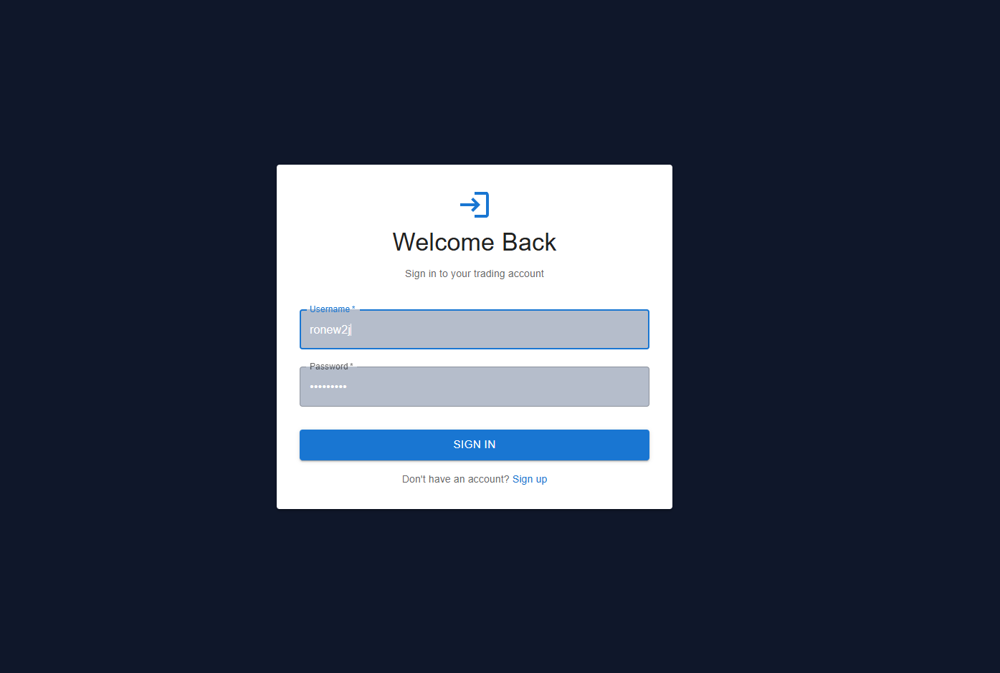

---

#### 2. Registration Page
*New user registration form*


---

#### 3. Dashboard
*Main dashboard with system overview, agent status, and portfolio metrics*

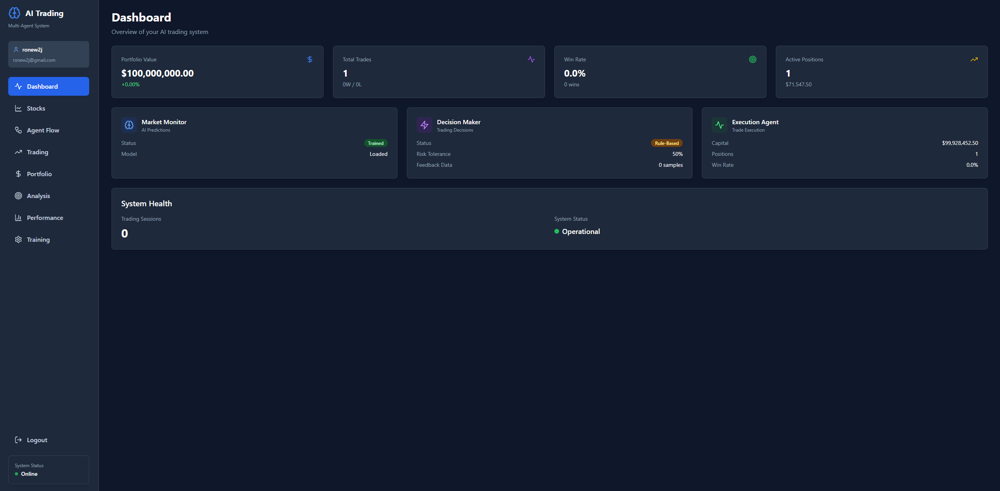

---

#### 4. Stocks Browser
*Browse all available stocks with search, filters, and pagination*

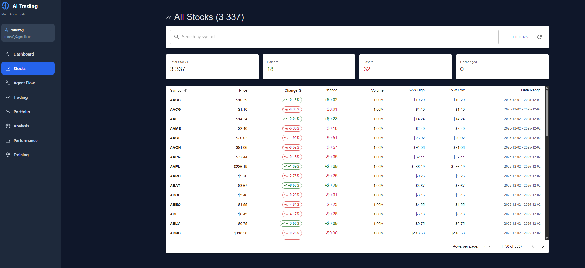

---

#### 5. Stock Detail Chart
*Historical price chart for individual stock*

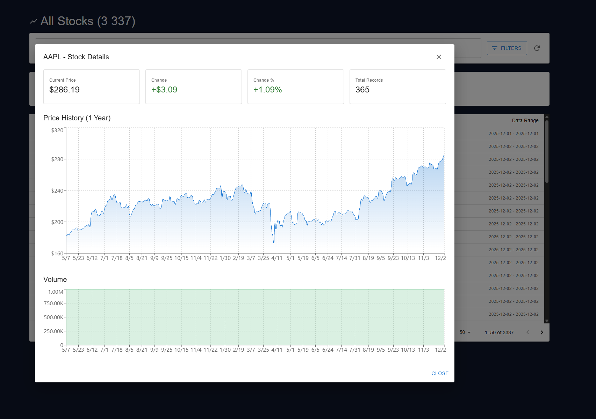

---

#### 6. Portfolio Overview
*Current positions, cash balance, and performance metrics*


---

#### 7. Portfolio Analysis
*Detailed portfolio analytics and charts*

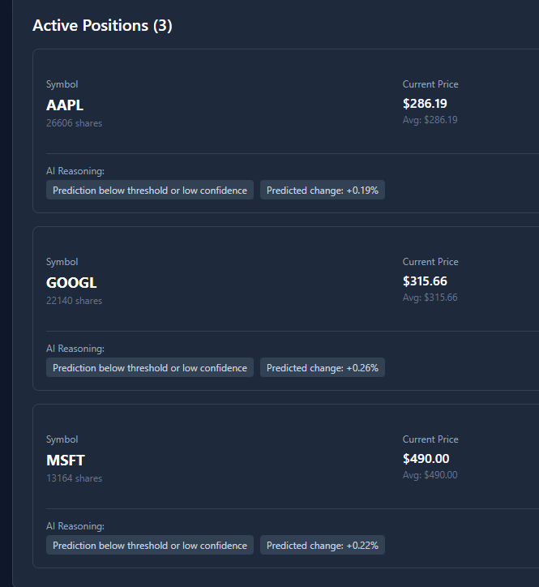

---

#### 8. Trading Interface
*Run trading cycles with risk tolerance settings*

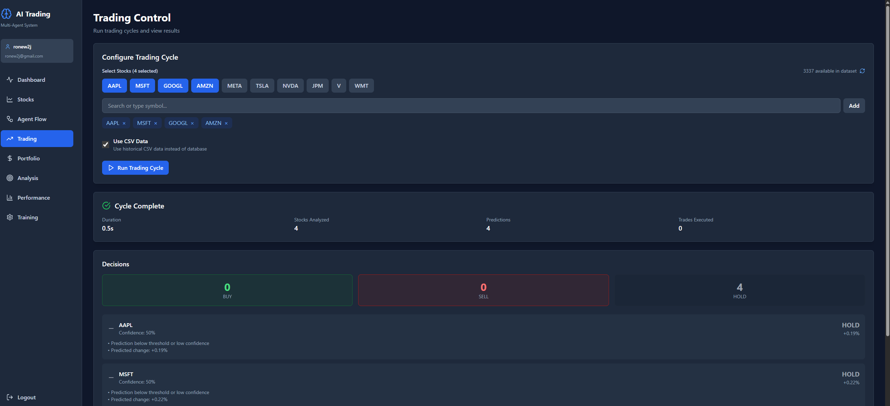

---

#### 9. Trading Results
*Trading cycle results with predictions and decisions*

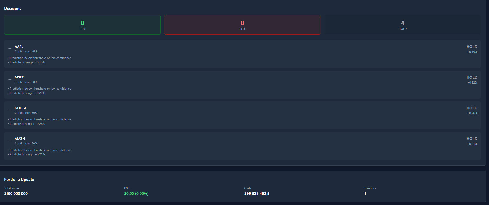

---

#### 10. Model Training
*Train ML models on historical data*

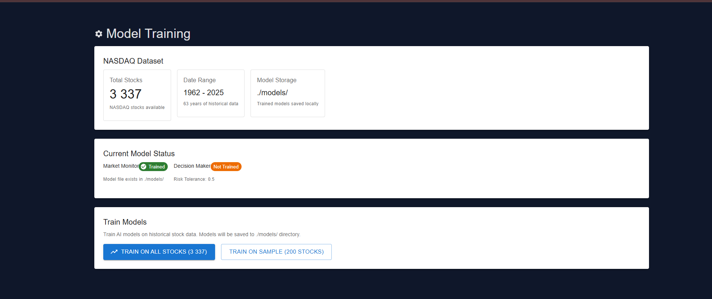

---

#### 11. Training Progress
*Training progress with metrics (RMSE, accuracy)*

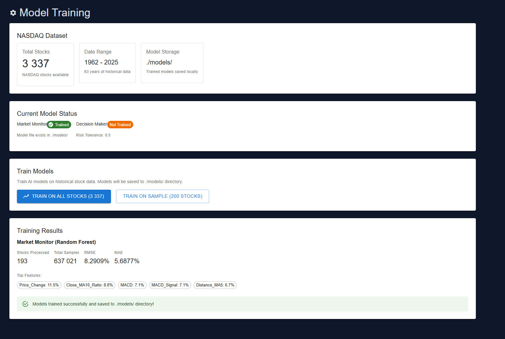

---

#### 12. Agent Flow Visualization
*Visual representation of agent communication*


---

#### 13. Trading Pipeline
*Reasons, Methods, Change metrics and execution decisions*

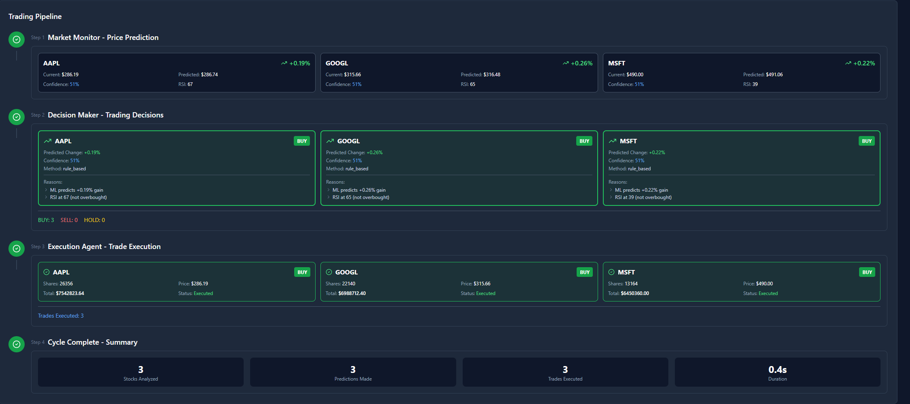

---

#### 14. Performance Metrics
*System performance and prediction accuracy*


---

#### 15. API Documentation (Swagger)
*FastAPI auto-generated API documentation*

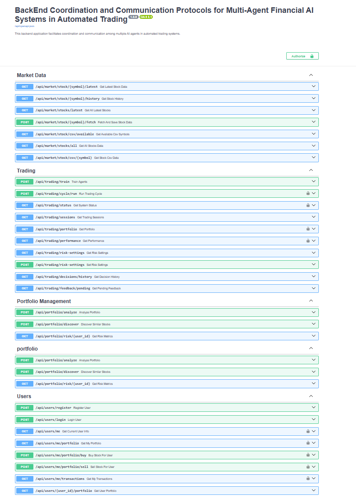

---

#### 16. Docker Containers
*Running Docker containers (PostgreSQL + FastAPI)*

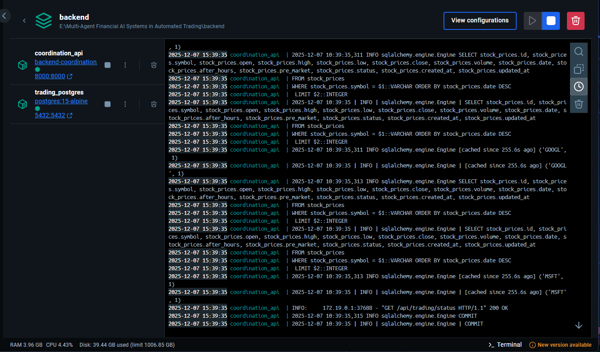

---

### ASCII Diagrams (Alternative if screenshots unavailable)

#### Dashboard Layout
```
┌────────────────────────────────────────────────────────────────┐
│  📊 DASHBOARD                                                   │
├────────────────────────────────────────────────────────────────┤
│                                                                 │
│  ┌─────────────┐ ┌─────────────┐ ┌─────────────┐ ┌───────────┐│
│  │ Market      │ │ Total       │ │ Portfolio   │ │ Win Rate  ││
│  │ Monitor     │ │ Trades      │ │ Value       │ │           ││
│  │   ✓ Trained │ │    156      │ │ $75,420     │ │   68%     ││
│  └─────────────┘ └─────────────┘ └─────────────┘ └───────────┘│
│                                                                 │
│  ┌──────────────────────────────────────────────────────────┐  │
│  │              PORTFOLIO PERFORMANCE CHART                  │  │
│  │                          ___---───                        │  │
│  │                     __--'                                 │  │
│  │                 _.-'                                      │  │
│  │            _,.-'                                          │  │
│  │        ,.-'                                               │  │
│  │    _.-'                                                   │  │
│  │  ─'                                                       │  │
│  │  Jan    Feb    Mar    Apr    May    Jun                   │  │
│  └──────────────────────────────────────────────────────────┘  │
│                                                                 │
└────────────────────────────────────────────────────────────────┘
```

#### Trading Interface Layout
```
┌────────────────────────────────────────────────────────────────┐
│  🔄 TRADING CYCLE                                               │
├────────────────────────────────────────────────────────────────┤
│                                                                 │
│  Risk Tolerance: [========░░] 0.7 (Aggressive)                 │
│                                                                 │
│  Selected Stocks: AAPL, MSFT, GOOGL, NVDA                      │
│                                                                 │
│  ┌──────────────────────────────────────────────────────────┐  │
│  │ RESULTS                                                   │  │
│  ├──────────────────────────────────────────────────────────┤  │
│  │ Symbol │ Current │ Predicted │ Change  │ Decision        │  │
│  ├────────┼─────────┼───────────┼─────────┼─────────────────┤  │
│  │ AAPL   │ $185.50 │ $188.20   │ +1.45%  │ 🟢 BUY (78%)   │  │
│  │ MSFT   │ $412.30 │ $415.80   │ +0.85%  │ 🟢 BUY (72%)   │  │
│  │ GOOGL  │ $141.20 │ $139.50   │ -1.20%  │ 🔴 SELL (81%)  │  │
│  │ NVDA   │ $875.40 │ $878.20   │ +0.32%  │ 🟡 HOLD (65%)  │  │
│  └──────────────────────────────────────────────────────────┘  │
│                                                                 │
│  [Run Trading Cycle]                                            │
│                                                                 │
└────────────────────────────────────────────────────────────────┘
```

### B. Key Code Snippets

#### Agent Initialization (coordinator.py)
```python
class TradingCoordinator:
    """Orchestrates all agent communication"""
    
    def __init__(self, user_id: Optional[int] = None, db_session: Optional[AsyncSession] = None):
        self.name = "Trading Coordinator"
        self.market_monitor = market_monitor
        self.decision_maker = decision_maker
        self.execution_agent = execution_agent
        
        if user_id and db_session:
            self.execution_agent.user_id = user_id
            self.execution_agent.db_session = db_session
        
        self._load_models_at_startup()
```

#### Price Prediction (market_agent.py)
```python
def predict(self, symbol: str, current_data: pd.DataFrame) -> Dict:
    """Generate price prediction with confidence score"""
    features = self._extract_features(current_data)
    features_scaled = self.scaler.transform(features)
    
    predicted_price = self.price_model.predict(features_scaled)[0]
    current_price = current_data['Close'].iloc[-1]
    
    change_percent = ((predicted_price - current_price) / current_price) * 100
    confidence = self._calculate_confidence(features)
    
    return {
        "symbol": symbol,
        "current_price": current_price,
        "predicted_price": predicted_price,
        "predicted_change_percent": change_percent,
        "confidence": confidence,
        "status": "predicted"
    }
```

#### Decision Logic (decision_agent.py)
```python
def make_rule_based_decision(self, prediction: Dict) -> Dict:
    """Make trading decision based on prediction and risk tolerance"""
    thresholds = self.get_thresholds()
    
    predicted_change = prediction.get("predicted_change_percent", 0)
    confidence = prediction.get("confidence", 0)
    
    if (predicted_change > thresholds["buy_threshold_percent"] and 
        confidence >= thresholds["min_confidence"]):
        decision = Decision.BUY
    elif (predicted_change < thresholds["sell_threshold_percent"] and 
          confidence >= thresholds["min_confidence"]):
        decision = Decision.SELL
    else:
        decision = Decision.HOLD
    
    return {
        "symbol": prediction["symbol"],
        "decision": decision,
        "confidence": confidence,
        "method": "rule_based"
    }
```

#### Trade Execution (execution_agent.py)
```python
async def execute_trade(self, session: AsyncSession, decision: Dict) -> Dict:
    """Execute a trading decision"""
    symbol = decision["symbol"]
    action = decision["decision"]
    
    if action == Decision.BUY:
        result = await portfolio_service.buy_stock(
            session, self.user_id, symbol,
            quantity=decision.get("quantity", 10),
            price=decision.get("current_price", 0)
        )
    elif action == Decision.SELL:
        result = await portfolio_service.sell_stock(
            session, self.user_id, symbol,
            quantity=decision.get("quantity", 10),
            price=decision.get("current_price", 0)
        )
    else:
        result = {"status": "HELD", "message": "No action taken"}
    
    self.total_trades += 1
    return result
```

---

## 📜 License

This project is licensed under the MIT License - see the [LICENSE](LICENSE) file for details.

---

## 👥 Contributors

- **RONEW2J** - *Initial work* - [GitHub](https://github.com/RONEW2J)

---

<div align="center">

**Built with ❤️ for Advanced Programming Course**

*Multi-Agent Financial AI Systems in Automated Trading*

December 2025

</div>
